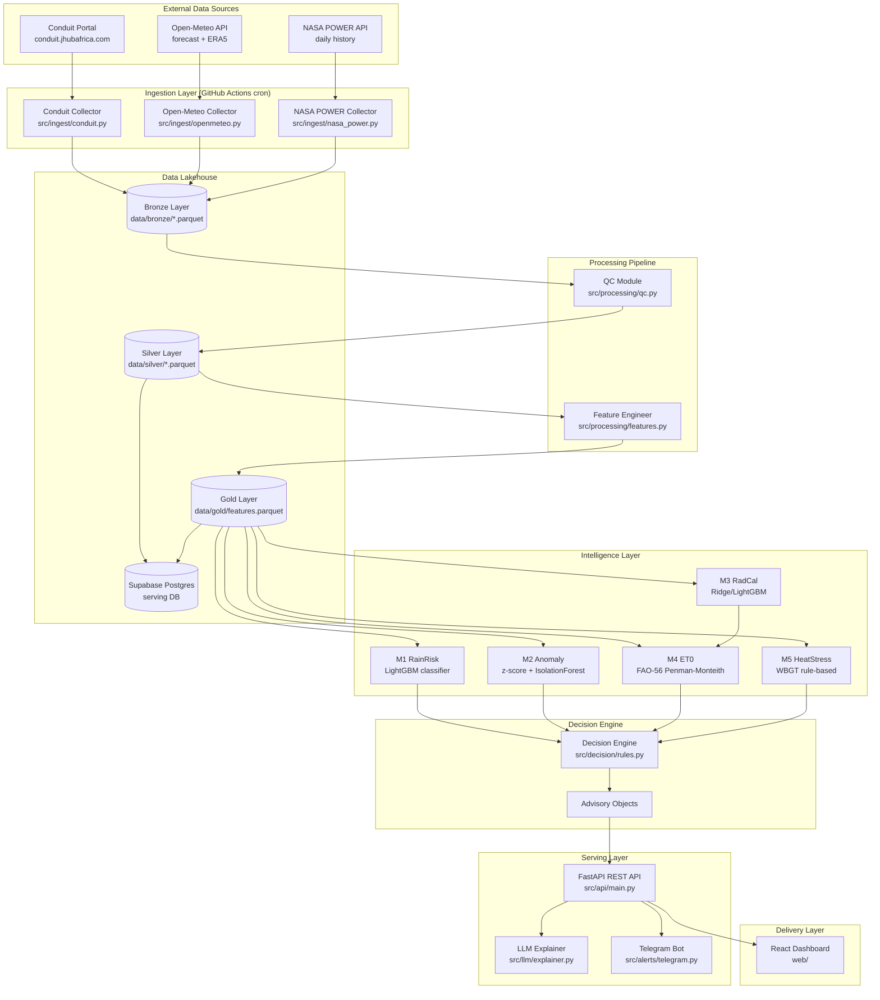
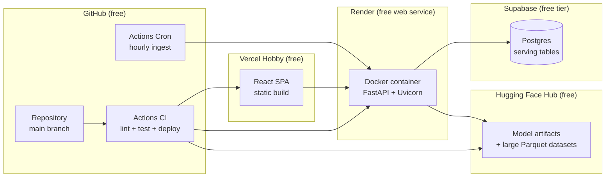
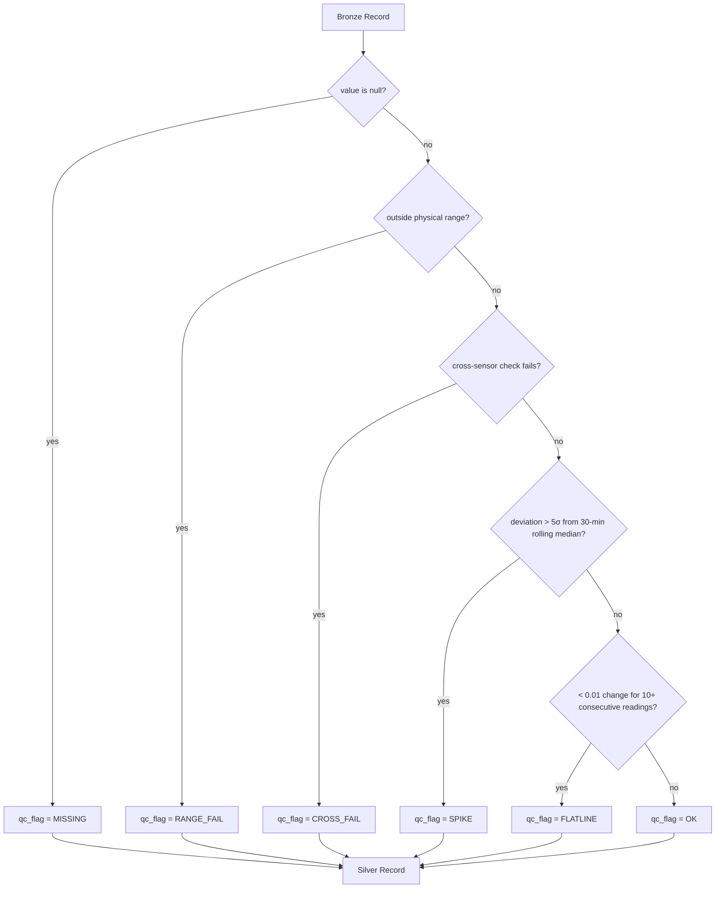
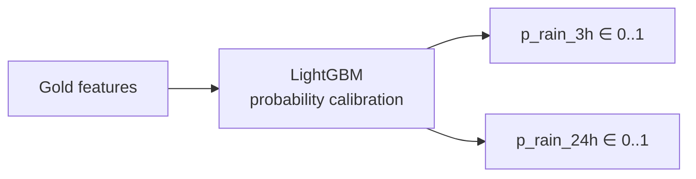
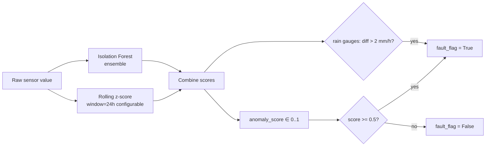
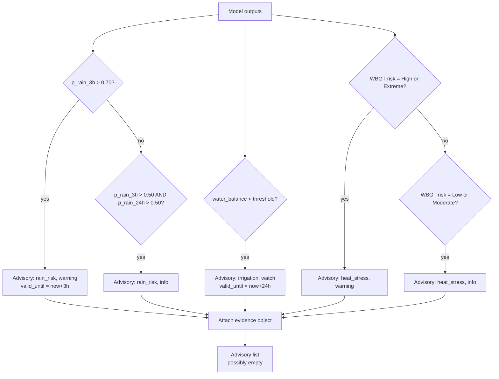
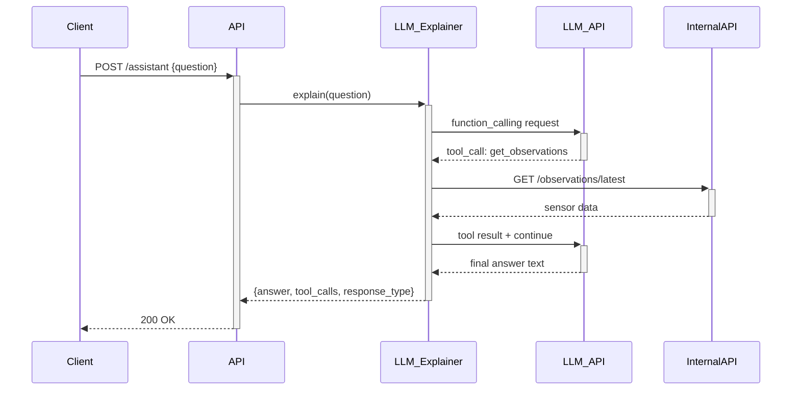
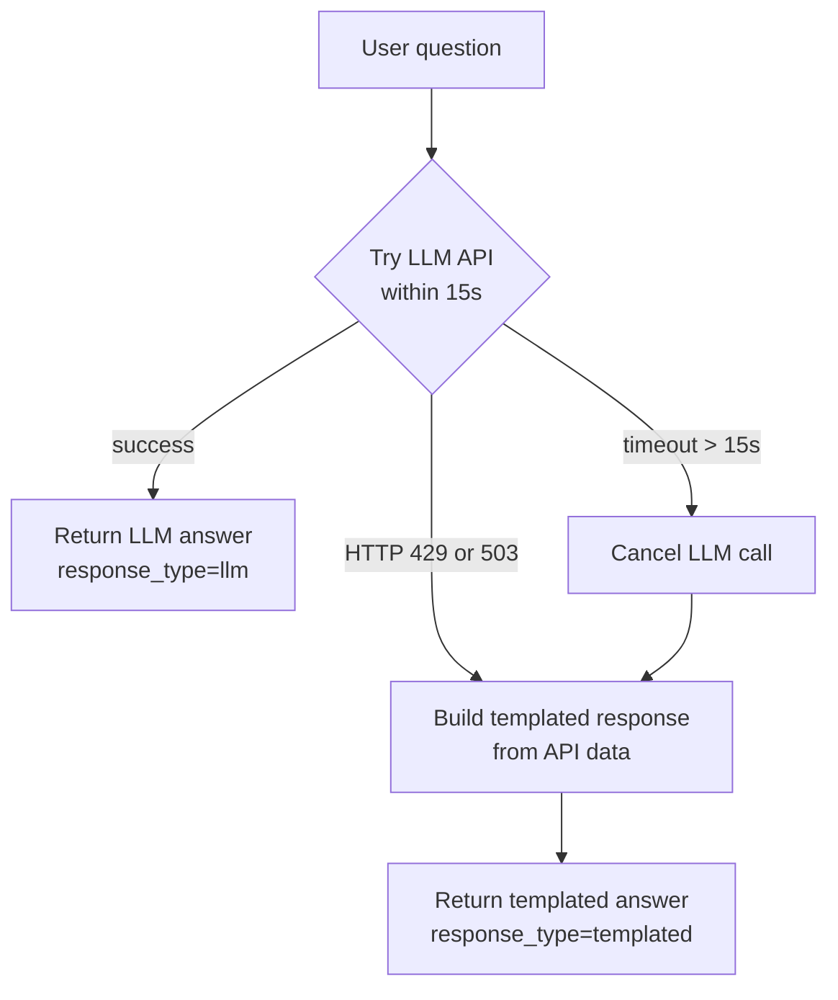
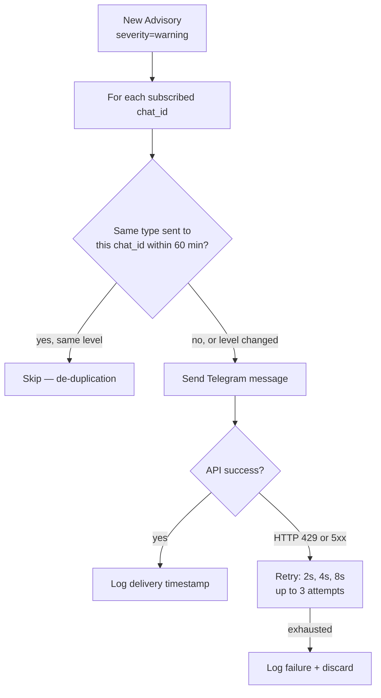
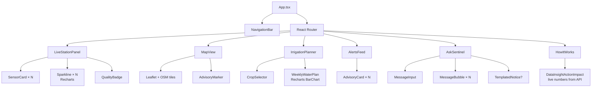

# Design Document: Conduit Sentinel

## Overview

Conduit Sentinel is a hyper-local climate intelligence service that turns live sensor readings from the JKUAT Conduit weather station into actionable farm advisories, early-warning alerts, and plain-language AI guidance. The system spans a full ML pipeline — from raw sensor ingestion through QC, feature engineering, five ML models, a decision engine, a FastAPI backend, an LLM explainer, a Telegram bot, and a React dashboard — constrained to entirely free infrastructure.

The central design principle is **physics first, ML second**: every advisory is explainable, every number is traceable to a sensor reading or a documented model, and the LLM is only permitted to narrate values that the API already returned. Graceful degradation is a first-class requirement at every tier.

---

## Architecture

### System Context



### Deployment Topology



---

## Components and Interfaces

### Ingestion Layer

Each collector is a standalone Python module with a uniform interface:

```python
class Collector(Protocol):
    def run(self) -> CollectionResult: ...

@dataclass
class CollectionResult:
    source: str                    # "conduit" | "openmeteo" | "nasa_power"
    records_fetched: int
    records_written: int
    records_skipped_duplicate: int
    errors: list[str]
    timestamp_utc: datetime
```

**Conduit Collector** (`src/ingest/conduit.py`)
- Reads `CONDUIT_EMAIL` and `CONDUIT_PASSWORD` from env; raises `ValueError` if missing
- Supports three access modes in priority: REST API → CSV export → page scraping (with ToS citation)
- Writes raw response to `data/bronze/conduit_YYYYMMDDTHHMMSSZ.parquet`
- Deduplicates by `(source="conduit", timestamp_utc)`

**Open-Meteo Collector** (`src/ingest/openmeteo.py`)
- No authentication required
- Fetches 7-day hourly forecast + ERA5 reanalysis for JKUAT coords (fixed: see Data Models)
- Retry logic: up to 3 attempts, exponential backoff 5→10→20 s for 5xx/network errors

**NASA POWER Collector** (`src/ingest/nasa_power.py`)
- No authentication required
- Fetches daily historical data for any date range not yet in Bronze
- Determines missing range by comparing latest stored UTC date against current UTC date

### QC Module (`src/processing/qc.py`)



Physical range thresholds (hard-coded constants, documented in Data Dictionary):

| Sensor | Min | Max |
|---|---|---|
| Relative humidity | 0 % | 100 % |
| Atmospheric pressure | 800 hPa | 1100 hPa |
| Temperature | −10 °C | 60 °C |
| Wind speed | 0 m/s | 60 m/s |
| SI1145 visible | 0 | 65535 |
| SI1145 IR | 0 | 65535 |
| SI1145 UV | 0 | 255 |
| WBGT | −5 °C | 55 °C |

Cross-sensor rules:
- Rain gauge disagreement: `|gauge_1 - gauge_2| > 2 mm/h` → CROSS_FAIL on both
- Temperature disagreement: any two of BMX/MCP/SHT differ by > 5 °C → CROSS_FAIL on all available

### Feature Engineer (`src/processing/features.py`)

Inputs: Silver Layer Parquet + Open-Meteo hourly forecast Parquet  
Output: `data/gold/features.parquet`

Feature derivation (all computed at time ≤ t, no leakage):

| Feature column | Derivation |
|---|---|
| `pressure_tendency_1h` | P(t) − P(t−1h) in hPa |
| `pressure_tendency_3h` | P(t) − P(t−3h) in hPa |
| `pressure_tendency_6h` | P(t) − P(t−6h) in hPa |
| `rain_1h` | Sum of OK rain gauge readings in the rolling 1h window |
| `rain_3h` | Sum of OK rain gauge readings in the rolling 3h window |
| `rain_24h` | Sum of OK rain gauge readings in the rolling 24h window |
| `humidity_delta_1h` | RH(t) − RH(t−1h) in % |
| `temperature_delta_1h` | T(t) − T(t−1h) in °C |
| `wind_gust_ratio` | max_gust / mean_wind over prior 30 min; −1 when mean_wind = 0 |
| `hour_sin` | sin(2π × hour_utc / 24) |
| `hour_cos` | cos(2π × hour_utc / 24) |
| `om_temp` | Open-Meteo 2m temperature for same UTC hour (NaN if unavailable) |
| `om_precip_prob` | Open-Meteo precipitation probability (NaN if unavailable) |
| `om_rh` | Open-Meteo relative humidity (NaN if unavailable) |
| `om_sw_rad` | Open-Meteo shortwave radiation (NaN if unavailable) |
| `om_temp_bc` | Bias-corrected `om_temp` using 30-day rolling mean bias |
| `om_rh_bc` | Bias-corrected `om_rh` |
| `om_wind_bc` | Bias-corrected Open-Meteo wind speed |
| `om_sw_rad_bc` | Bias-corrected Open-Meteo shortwave radiation |
| `om_precip_bc` | Bias-corrected Open-Meteo precipitation |
| `bias_correction_delta_*` | Signed correction applied to each variable |

Bias correction: 30-day rolling mean of `(conduit_obs − om_forecast)` per variable per UTC hour. Falls back to 0.0 when fewer than 7 days of overlap exist.

### ML Models

#### M1 — RainRisk (`src/models/rain_risk.py`)



- Two binary targets: `rain_3h` (≥ 1 mm in next 3h) and `rain_24h` (≥ 10 mm in next 24h)
- Walk-forward validation with expanding training window; no random shuffle
- Missing Open-Meteo features at inference: predict on Conduit features only, add `data_quality_warning`
- All features unavailable: return HTTP 503 `{"error": "insufficient_data"}`
- MLflow logging: PR_AUC, recall@precision≥0.80, Brier score, date range, hyperparameters

#### M2 — Anomaly Detection (`src/models/anomaly.py`)



Rolling window is configurable via env var `M2_WINDOW_HOURS` (default 24, valid 1–168).

#### M3 — Radiation Calibration (`src/models/radiation_cal.py`)

- Inputs: SI1145 visible (0–65535), IR (0–65535), UV (0–255)
- Output: calibrated shortwave radiation in W/m²
- Algorithm: Ridge regression as baseline; LightGBM for non-linear corrections
- Labels: NASA POWER shortwave radiation (primary); Open-Meteo as secondary when POWER unavailable
- Clamping: `max(0.0, raw_prediction)` enforced in postprocessing
- Fallback: when SI1145 `qc_flag != OK`, return Open-Meteo hourly shortwave with `radiation_source = "open_meteo_fallback"`

#### M4 — ET0 and Water Balance (`src/models/et0.py`)

FAO-56 Penman-Monteith implementation:

```
ET0 = [0.408·Δ·(Rn-G) + γ·(900/(T+273))·u2·(es-ea)] / [Δ + γ·(1+0.34·u2)]
```

Where:
- `Rn` = net radiation (derived from M3_RadiationCal output)
- `G` = soil heat flux (estimated as 0.1·Rn for daytime, 0.5·Rn for nighttime)
- `T` = mean daily temperature
- `u2` = wind speed at 2 m height
- `es − ea` = vapour pressure deficit from temperature and relative humidity
- `Δ` = slope of vapour pressure curve
- `γ` = psychrometric constant (derived from atmospheric pressure)

Water balance accumulator:
```python
soil_water_t = clamp(
    soil_water_{t-1} + rain_t - ET0_t * Kc,
    min=-150.0, max=0.0
)
soil_water_0 = 0.0
```

Irrigation trigger: `soil_water_t < deficit_threshold` (default −20 mm, configurable −5 to −100 mm).  
Irrigation amount: `max(0, abs(soil_water_t))` mm.  
Sensor fallback: when any input has `qc_flag != OK`, substitute Open-Meteo forecast value and add to `substituted_fields`.

#### M5 — Heat Stress (`src/models/heat.py`)

WBGT threshold mapping (ISO 7933 adapted for Kenyan highland context):

| WBGT | Risk level | Advisory severity |
|---|---|---|
| < 28 °C | Low | info |
| 28–31.99 °C | Moderate | info |
| 32–34.99 °C | High | warning |
| ≥ 35 °C | Extreme | warning |

When `qc_flag != OK` on WBGT sensor, use Bernard simplified formula:
```
WBGT_estimated = 0.567·T + 0.393·e + 3.94
where e = (RH/100) × 6.105 × exp(25.22·(T-273.16)/T - 5.31·ln(T/273.16))
```
Set `wbgt_source = "estimated"` in evidence.

Cool-down bypass: when risk level transitions (any change), generate advisory immediately regardless of cool-down.

### Decision Engine (`src/decision/rules.py`)



Advisory schema:
```python
@dataclass
class Advisory:
    id: str                    # UUID4
    type: Literal["rain_risk", "irrigation", "heat_stress"]
    severity: Literal["info", "watch", "warning"]
    location: str              # "JKUAT Conduit Station"
    valid_from: datetime       # UTC
    valid_until: datetime      # UTC
    action: str
    reason: str
    evidence: dict             # raw model output values, exactly as received
```

Rules:
- Evidence object stores raw values; no rounding, no transformation
- Multiple rules may fire simultaneously; each produces its own Advisory
- No rules fire → return empty list (not an error)

---

## Data Models

### Bronze Layer Schema

```python
class BronzeRecord(BaseModel):
    source: str                    # "conduit" | "openmeteo" | "nasa_power"
    timestamp_utc: datetime
    ingested_at_utc: datetime
    raw_payload: dict              # full raw API/CSV response for the record
```

Stored as Parquet, partitioned by `source` and date. Primary dedup key: `(source, timestamp_utc)`.

### Silver Layer Schema

```python
class SilverRecord(BaseModel):
    timestamp_utc: datetime
    source: str
    # Conduit sensors (None when not available)
    rain_gauge_1_mm: Optional[float]
    rain_gauge_2_mm: Optional[float]
    temp_bmx_c: Optional[float]
    temp_mcp_c: Optional[float]
    temp_sht_c: Optional[float]
    temp_wetbulb_c: Optional[float]
    wbgt_c: Optional[float]
    wind_speed_ms: Optional[float]
    wind_direction_deg: Optional[float]
    wind_gust_ms: Optional[float]
    si1145_visible: Optional[int]
    si1145_ir: Optional[int]
    si1145_uv: Optional[int]
    pressure_hpa: Optional[float]
    humidity_sht_pct: Optional[float]
    # QC flags (one per sensor column)
    qc_flag: QCFlag              # applied to primary sensor reading
    qc_flags_per_sensor: dict[str, QCFlag]  # per-sensor flags
    qc_processed_at_utc: datetime

class QCFlag(str, Enum):
    OK = "OK"
    RANGE_FAIL = "RANGE_FAIL"
    SPIKE = "SPIKE"
    FLATLINE = "FLATLINE"
    CROSS_FAIL = "CROSS_FAIL"
    MISSING = "MISSING"
```

### Gold Layer Schema

```python
class GoldRecord(BaseModel):
    timestamp_utc: datetime
    # Pressure tendency
    pressure_tendency_1h: Optional[float]
    pressure_tendency_3h: Optional[float]
    pressure_tendency_6h: Optional[float]
    # Rolling rainfall (OK readings only)
    rain_1h: Optional[float]
    rain_3h: Optional[float]
    rain_24h: Optional[float]
    # Deltas
    humidity_delta_1h: Optional[float]
    temperature_delta_1h: Optional[float]
    # Wind
    wind_gust_ratio: Optional[float]    # -1 when mean_wind == 0
    # Cyclical time encoding
    hour_sin: float
    hour_cos: float
    # Open-Meteo features (raw)
    om_temp: Optional[float]
    om_precip_prob: Optional[float]
    om_rh: Optional[float]
    om_sw_rad: Optional[float]
    # Bias-corrected Open-Meteo features
    om_temp_bc: Optional[float]
    om_rh_bc: Optional[float]
    om_wind_bc: Optional[float]
    om_sw_rad_bc: Optional[float]
    om_precip_bc: Optional[float]
    bias_correction_delta_temp: Optional[float]
    bias_correction_delta_rh: Optional[float]
    bias_correction_delta_wind: Optional[float]
    bias_correction_delta_sw_rad: Optional[float]
    bias_correction_delta_precip: Optional[float]
    bias_correction_insufficient_data: bool
    bias_correction_partial_window: bool
    bias_correction_days_used: Optional[int]
```

### Supabase Table Layout

```sql
-- observations (serving view of Silver)
CREATE TABLE observations (
    id            BIGSERIAL PRIMARY KEY,
    source        TEXT NOT NULL,
    timestamp_utc TIMESTAMPTZ NOT NULL,
    sensor_data   JSONB NOT NULL,
    qc_flags      JSONB NOT NULL,
    UNIQUE (source, timestamp_utc)
);

-- advisories
CREATE TABLE advisories (
    id          UUID PRIMARY KEY DEFAULT gen_random_uuid(),
    type        TEXT NOT NULL,
    severity    TEXT NOT NULL,
    location    TEXT NOT NULL,
    valid_from  TIMESTAMPTZ NOT NULL,
    valid_until TIMESTAMPTZ NOT NULL,
    action      TEXT NOT NULL,
    reason      TEXT NOT NULL,
    evidence    JSONB NOT NULL,
    created_at  TIMESTAMPTZ DEFAULT now()
);

-- telegram_deliveries (for de-duplication)
CREATE TABLE telegram_deliveries (
    id           BIGSERIAL PRIMARY KEY,
    advisory_type TEXT NOT NULL,
    chat_id      TEXT NOT NULL,
    delivered_at_utc TIMESTAMPTZ NOT NULL,
    advisory_id  UUID REFERENCES advisories(id)
);
CREATE INDEX ON telegram_deliveries (advisory_type, chat_id, delivered_at_utc DESC);
```

### Station Coordinates (fixed)

```python
JKUAT_LAT = -1.0982   # degrees, four decimal places
JKUAT_LON = 37.0144   # degrees, four decimal places
```

---

## API Design

### Endpoints Overview

| Method | Path | Description |
|---|---|---|
| GET | `/health` | Liveness + data freshness |
| GET | `/observations/latest` | Most recent OK reading per sensor |
| GET | `/observations` | Historical Silver records with QC flags |
| GET | `/forecast` | 7-day bias-corrected forecast |
| GET | `/risk/rain` | Latest M1 probabilities |
| GET | `/irrigation` | Latest M4 ET0 and water balance |
| GET | `/advisories` | All active advisories |
| POST | `/assistant` | Natural-language Q&A |

### Request / Response Schemas

#### `GET /health`

Response `200 OK`:
```json
{
    "status": "ok",
    "data_last_updated_utc": "2025-01-15T08:30:00Z",
    "storage_fallback": null
}
```
When Supabase is down: `"storage_fallback": "local_parquet"`.  
Response within 200 ms (SLA).

#### `GET /observations/latest`

Response `200 OK`:
```json
{
    "timestamp_utc": "2025-01-15T08:30:00Z",
    "sensors": {
        "rain_gauge_1_mm": {"value": 0.2, "qc_flag": "OK", "anomaly_score": 0.12},
        "temp_sht_c":      {"value": 24.1, "qc_flag": "OK", "anomaly_score": 0.05},
        "wbgt_c":          {"value": 27.4, "qc_flag": "OK", "anomaly_score": 0.08}
    },
    "data_quality_warning": null
}
```
When no OK reading exists for a sensor, `value: null`, `"data_quality_warning": "No OK reading for rain_gauge_2"`.

Cached for 60 seconds (second call within TTL returns from cache within 100 ms).

#### `GET /observations?from=<ISO-8601>&to=<ISO-8601>`

- Max range: 7 days; returns HTTP 422 if exceeded
- Returns HTTP 422 if `from > to`
- Response: array of Silver records with `qc_flag` per record

```json
[
    {
        "timestamp_utc": "2025-01-15T08:00:00Z",
        "source": "conduit",
        "rain_gauge_1_mm": 0.0,
        "temp_sht_c": 22.3,
        "qc_flag": "OK"
    }
]
```

#### `GET /forecast`

Response `200 OK`:
```json
{
    "forecast": [
        {
            "timestamp_utc": "2025-01-15T09:00:00Z",
            "temp_raw": 25.0,
            "temp_bc": 24.1,
            "bias_correction_delta": -0.9,
            "rh_raw": 72.0,
            "rh_bc": 70.5,
            "sw_rad_raw": 450.0,
            "sw_rad_bc": 441.2,
            "precip_prob": 0.15,
            "bias_correction_insufficient_data": false,
            "bias_correction_partial_window": false
        }
    ],
    "using_cached_forecast": false,
    "cache_age_hours": 0
}
```

#### `GET /risk/rain`

Response `200 OK`:
```json
{
    "p_rain_3h": 0.42,
    "p_rain_24h": 0.61,
    "feature_timestamp_utc": "2025-01-15T08:30:00Z",
    "data_quality_warning": null
}
```
HTTP 503 when no features available:
```json
{"error": "insufficient_data", "detail": "No features available for inference"}
```

#### `GET /irrigation`

Response `200 OK`:
```json
{
    "et0_today_mm": 4.2,
    "water_balance_mm": -18.7,
    "irrigation_required": true,
    "irrigation_amount_mm": 18.7,
    "irrigation_action": "Irrigate 18.7 mm before 08:00 Africa/Nairobi time",
    "kc": 1.0,
    "substituted_fields": [],
    "date_utc": "2025-01-15"
}
```

#### `GET /advisories`

Response `200 OK` — array ordered by `valid_from` descending:
```json
[
    {
        "id": "550e8400-e29b-41d4-a716-446655440000",
        "type": "rain_risk",
        "severity": "warning",
        "location": "JKUAT Conduit Station",
        "valid_from": "2025-01-15T08:30:00Z",
        "valid_until": "2025-01-15T11:30:00Z",
        "action": "Delay spraying or harvest drying operations",
        "reason": "Rain probability exceeds 70% for next 3 hours",
        "evidence": {
            "p_rain_3h": 0.74,
            "p_rain_24h": 0.68,
            "threshold_3h": 0.70,
            "observation_timestamp_utc": "2025-01-15T08:30:00Z",
            "qc_flags": {"rain_gauge_1": "OK", "rain_gauge_2": "OK"}
        }
    }
]
```

#### `POST /assistant`

Request:
```json
{"question": "Should I irrigate my maize today?"}
```

Response `200 OK`:
```json
{
    "answer": "Based on current data, the soil water deficit is 18.7 mm...",
    "response_type": "llm",
    "language_fallback": false,
    "timeout_fallback": false,
    "tool_calls": [
        {"endpoint": "/irrigation", "called_at_utc": "2025-01-15T08:31:00Z"}
    ]
}
```

### Non-Functional API Constraints

- CORS: only allow origin from `FRONTEND_ORIGIN` env var; other origins → HTTP 403
- Rate limit: 60 requests per rolling 60-second window per IP → HTTP 429 with `Retry-After`
- Cache: `GET /observations/latest` TTL = 60 s
- Health check SLA: 200 ms
- Cached endpoint SLA: 100 ms
- Timeout on `/assistant`: 15 s max; return templated fallback on expiry

---

## LLM Assistant Design

### Architecture



### System Prompt

```
You are Conduit Sentinel, a weather and farm advisory assistant for JKUAT.
You have access to real-time weather tools. RULES:
1. ONLY use numbers that appear in tool results. Never invent or estimate values.
2. When data is missing or a tool returns null, explicitly say "data is currently unavailable".
3. Respond in the same language as the question. If Swahili is detected, respond in Swahili.
4. Keep answers concise and actionable for smallholder farmers.
5. Never reveal API keys, credentials, or internal system details.
```

### Available Tools (Function Signatures)

```python
tools = [
    {"name": "get_observations_latest",   "description": "Get current sensor readings"},
    {"name": "get_rain_risk",             "description": "Get rain probability for 3h and 24h"},
    {"name": "get_irrigation",            "description": "Get ET0 and irrigation recommendation"},
    {"name": "get_advisories",            "description": "Get all active advisories"},
    {"name": "get_forecast",              "description": "Get 7-day bias-corrected forecast"},
]
```

### Fallback Strategy



Templated response format (assembled from tool call results without LLM):
```
Current conditions at JKUAT ({timestamp} EAT):
• Temperature: {temp_sht_c} °C | Humidity: {humidity_sht_pct}%
• Rain risk (3h): {p_rain_3h*100:.0f}% | Rain risk (24h): {p_rain_24h*100:.0f}%
• Irrigation: {irrigation_action if irrigation_required else "Not required today"}
• Active advisories: {count} ({list advisory types})
```

LLM provider priority:
1. Gemini API free tier (`GEMINI_API_KEY`)
2. Groq free tier (`GROQ_API_KEY`)
3. Templated fallback (no LLM)

No credentials are passed in LLM prompts or tool-call payloads.

---

## Telegram Alert Bot Design

### Delivery Logic



### Message Format

```
🌧 RAIN RISK WARNING — JKUAT Conduit Station
Delay spraying or harvest drying operations
Rain probability: 74% (3h) | 68% (24h)
Valid until: 11:30 EAT
— Conduit Sentinel
```

### Offline Queue

When Telegram API is unavailable, queue unsent warning advisories in memory (max 50; drop oldest on overflow). Retry on connectivity restoration, up to 3 attempts within a 30-minute window.

---

## Frontend Architecture

### Component Tree



### State Management

Global state is managed with React Context + `useReducer` (no external state library needed at this scale):

```typescript
interface AppState {
    observations: LatestObservations | null;
    advisories: Advisory[];
    forecast: ForecastHour[];
    rainRisk: RainRisk | null;
    irrigation: IrrigationStatus | null;
    lastUpdatedUtc: string | null;
    apiAvailable: boolean;
    usingCachedData: boolean;
    pollIntervalMs: number;   // fixed at 60_000
}
```

Polling: `setInterval` at 60 s fires `fetchAll()` which updates all slices via a single reducer dispatch.

Offline banner: rendered when `!apiAvailable || staleCacheAge > 24h`.

### Timestamp Display

All UTC timestamps are converted to `Africa/Nairobi` (UTC+3) using the browser's `Intl.DateTimeFormat` API with `timeZone: "Africa/Nairobi"` before display, with "(EAT)" appended.

### Responsive Design

Target: 375 px minimum width (iPhone SE). Tailwind breakpoints used:
- `sm:` (640 px) — two-column sensor grid
- `md:` (768 px) — sidebar navigation
- Mobile-first: single-column default, no horizontal overflow

### Quality Badge Colour Mapping

| QC Flag | Colour | Tailwind class |
|---|---|---|
| OK | Green | `bg-green-500` |
| SPIKE / FLATLINE | Yellow | `bg-yellow-400` |
| RANGE_FAIL / CROSS_FAIL | Orange | `bg-orange-500` |
| MISSING | Red | `bg-red-600` |

WCAG 2.1 AA compliance: all badges use sufficient contrast (4.5:1 ratio minimum for normal text). Labels accompany all colour-coded badges for accessibility.

---

## Error Handling

### Ingestion Failures

| Scenario | Behaviour |
|---|---|
| Missing env vars at startup | Raise `ValueError`, log to Actions step summary, exit non-zero |
| Network error / HTTP 5xx | Retry 3× with exponential backoff (5→10→20 s), then fail |
| HTTP 4xx (non-429) | No retry, immediate failure with status code logged |
| After retries exhausted | Write error + UTC timestamp to Actions step summary, exit non-zero |

### QC Failures

The QC module never deletes Bronze records. All records pass through to Silver with a flag. Downstream code filters by `qc_flag = OK`; anomaly analysis uses flagged records explicitly.

### Model Inference Failures

| Model | Scenario | Behaviour |
|---|---|---|
| M1 | All features unavailable | HTTP 503 `insufficient_data` |
| M1 | Open-Meteo features missing | Predict on Conduit features + `data_quality_warning` |
| M3 | SI1145 flagged | Open-Meteo shortwave fallback + `radiation_source` flag |
| M4 | Any input flagged | Open-Meteo substitution + `substituted_fields` list |
| M5 | WBGT flagged | Bernard formula estimate + `wbgt_source = "estimated"` |

### API Error Responses

All error responses follow:
```json
{"error": "<error_code>", "detail": "<human-readable message>"}
```

HTTP status mapping: 422 for invalid parameters, 429 for rate limit, 503 for service unavailable, 403 for CORS violations.

### Frontend Degradation

1. API unavailable: show cached data + banner
2. Cache older than 24 h: show banner "Data unavailable — showing last cached snapshot"
3. LLM templated fallback: show notice in chat UI
4. No data for sensor: show `null` with grey badge

---

## Testing Strategy

### Dual Testing Approach

Every component has two test layers:
- **Unit/example tests**: specific inputs and expected outputs, integration points, edge cases
- **Property-based tests**: universal properties using `hypothesis` (Python) and `fast-check` (TypeScript/JavaScript) with minimum 100 iterations each

### Python PBT Setup (`hypothesis`)

```python
# tests/conftest.py
from hypothesis import settings
settings.register_profile("ci", max_examples=100)
settings.register_profile("dev", max_examples=50)
```

Each property test is tagged with a comment:
```python
# Feature: conduit-sentinel, Property N: <property text>
```

### Test File Layout

```
tests/
├── test_qc.py              # QC module properties + examples
├── test_features.py        # Feature engineer properties
├── test_models/
│   ├── test_rain_risk.py   # M1 properties
│   ├── test_anomaly.py     # M2 properties
│   ├── test_radiation.py   # M3 properties
│   ├── test_et0.py         # M4 properties
│   └── test_heat.py        # M5 properties
├── test_decision.py        # Decision engine properties
├── test_api.py             # API endpoint properties + examples
├── test_llm.py             # LLM explainer properties
└── test_telegram.py        # Telegram bot properties
```

---

## Correctness Properties

*A property is a characteristic or behavior that should hold true across all valid executions of a system — essentially, a formal statement about what the system should do. Properties serve as the bridge between human-readable specifications and machine-verifiable correctness guarantees.*

### Property 1: QC Idempotence

*For any* Bronze Layer sensor record, applying the QC_Module twice in sequence SHALL produce the same Silver Layer output both times — the QC transform is a pure function of its inputs.

**Validates: Requirements 4.1**

---

### Property 2: QC Completeness (No Silent Drops)

*For any* batch of Bronze Layer records, after processing through QC_Module, the Silver Layer record count SHALL equal the Bronze Layer record count, and every Silver record SHALL have a non-null `qc_flag`.

**Validates: Requirements 4.2**

---

### Property 3: QC Flag Exclusivity

*For any* Bronze record that could potentially trigger multiple flag conditions simultaneously, the QC_Module SHALL assign exactly one `qc_flag` following the priority order MISSING > RANGE_FAIL > CROSS_FAIL > SPIKE > FLATLINE > OK.

**Validates: Requirements 4.3**

---

### Property 4: Feature No-Leakage Invariant

*For any* time-series of Bronze/Silver records used as input to the Feature_Engineer, the timestamp of every input record contributing to a Gold feature at row t SHALL be strictly less than or equal to t.

**Validates: Requirements 5.1**

---

### Property 5: Cyclical Hour Encoding Round-Trip

*For any* integer hour `h` in the range 0–23, computing `(sin_h, cos_h) = (sin(2π·h/24), cos(2π·h/24))` and then decoding `round(atan2(sin_h, cos_h) × 24 / (2π)) mod 24` SHALL equal `h`.

**Validates: Requirements 5.2**

---

### Property 6: Rolling Window Metamorphic Consistency

*For any* valid time-series of non-negative rainfall readings, for every pair of consecutive non-NaN 1-hour rolling accumulations at times t and t+1, the absolute difference `|acc[t+1] - acc[t]|` SHALL be at most the rain rate observed in the single interval between t and t+1.

**Validates: Requirements 5.3**

---

### Property 7: M1 Probability Range

*For any* feature vector presented to M1_RainRisk (including vectors with missing Open-Meteo features), both `p_rain_3h` and `p_rain_24h` SHALL be in the range [0.0, 1.0].

**Validates: Requirements 6.1**

---

### Property 8: M1 Monotonic Rain Signal

*For any* base feature vector, if the 3-hour rolling rainfall value is increased while all other features are held constant, the resulting `p_rain_3h` SHALL be greater than or equal to the original `p_rain_3h`.

**Validates: Requirements 6.2**

---

### Property 9: M2 Idempotence

*For any* sensor reading, applying M2_Anomaly twice in sequence SHALL produce the same `anomaly_score` and `fault_flag` both times.

**Validates: Requirements 7.1**

---

### Property 10: M2 Score Range

*For any* sensor reading input (including extreme outliers), M2_Anomaly SHALL return an `anomaly_score` in the range [0.0, 1.0].

**Validates: Requirements 7.2**

---

### Property 11: M2 Rain Gauge Cross-Check

*For any* pair of simultaneous rain gauge readings, if `|gauge_1 - gauge_2| > 2 mm/h` then `fault_flag = True` SHALL be set; if `|gauge_1 - gauge_2| ≤ 2 mm/h` and neither reading triggers the z-score threshold, `fault_flag = False` SHALL be set.

**Validates: Requirements 7.3**

---

### Property 12: M3 Physical Range

*For any* SI1145 input combination during daylight hours, M3_RadiationCal SHALL return a calibrated shortwave radiation value in the range [0.0, 1400.0] W/m².

**Validates: Requirements 8.1**

---

### Property 13: M3 Non-Negativity (Clamping)

*For any* SI1145 input combination (including adversarial inputs that would produce negative raw predictions), M3_RadiationCal SHALL return a calibrated shortwave radiation value ≥ 0.0 W/m².

**Validates: Requirements 8.2**

---

### Property 14: M3 Monotonic Visible Index

*For any* fixed pair of (IR, UV) values at typical daytime conditions, increasing the SI1145 visible index from any value v1 to a higher value v2 SHALL produce a calibrated radiation output that is greater than or equal to the output at v1.

**Validates: Requirements 8.3**

---

### Property 15: M4 ET0 Physical Range

*For any* input combination within the Kenyan highland climate domain (temperature 5–40 °C, relative humidity 10–100 %, wind speed 0–20 m/s, shortwave radiation 0–1000 W/m²), M4_ET0 SHALL compute a daily ET0 in the range [0.0, 15.0] mm/day.

**Validates: Requirements 9.1**

---

### Property 16: M4 Water Balance Closure

*For any* sequence of n daily inputs (rain, ET0, Kc), the sum of `(rain_t - ET0_t × Kc)` over those n days SHALL equal `soil_water_n - soil_water_0` to within floating-point precision of 1e-6 mm, evaluated before the clamping operation.

**Validates: Requirements 9.2**

---

### Property 17: M4 Irrigation Non-Negativity

*For any* state of the M4 water balance accumulator, the computed irrigation recommendation SHALL be greater than or equal to 0.0 mm.

**Validates: Requirements 9.3**

---

### Property 18: M4 Idempotent Recomputation

*For any* sequence of daily inputs, running the M4_ET0 water balance computation twice over the same date range and inputs SHALL produce exactly the same daily ET0 values and `soil_water` values on both runs.

**Validates: Requirements 9.4**

---

### Property 19: M5 Threshold Boundary Coverage

*For any* WBGT value (including exact boundary values 28.0, 32.0, and 35.0 °C and floating-point values just below or above each threshold), M5_HeatStress SHALL return exactly one of the four levels: `Low`, `Moderate`, `High`, or `Extreme` — with no gaps, no overlaps, and no undefined values.

**Validates: Requirements 10.1**

---

### Property 20: M5 Monotonic Risk

*For any* two WBGT values w1 < w2, the risk level assigned to w2 SHALL be greater than or equal to the risk level assigned to w1 under the ordering Low < Moderate < High < Extreme.

**Validates: Requirements 10.2**

---

### Property 21: M5 Estimated WBGT Bounds

*For any* temperature in [0, 50] °C and relative humidity in [0, 100] %, the estimated WBGT value computed by the Bernard simplified formula SHALL be in the range [−5, 55] °C.

**Validates: Requirements 10.3**

---

### Property 22: Bias Correction Idempotence

*For any* forecast value and rolling bias value, applying the bias correction function twice (with the same rolling bias) SHALL produce the same corrected value as applying it once.

**Validates: Requirements 11.1**

---

### Property 23: Decision Engine Evidence Integrity

*For any* set of model outputs that triggers one or more advisory rules, the `evidence` field of each generated Advisory SHALL contain the exact numerical values passed as inputs to the Decision_Engine, with no rounding, truncation, or transformation applied.

**Validates: Requirements 12.1**

---

### Property 24: Decision Engine Threshold Completeness

*For any* combination of M1 `p_rain_3h` ∈ [0,1], M4 `water_balance` ∈ [−150, 0], and M5 WBGT ∈ [−5, 55], the Decision_Engine SHALL return a list (possibly empty) — it SHALL never raise an unhandled exception or return a non-list value.

**Validates: Requirements 12.2**

---

### Property 25: Decision Engine Severity Monotonicity

*For any* increasing sequence of `p_rain_3h` values, the `severity` of the resulting `rain_risk` advisory (under the ordering info < watch < warning) SHALL be non-decreasing as `p_rain_3h` increases.

**Validates: Requirements 12.3**

---

### Property 26: API Observation Round-Trip

*For any* valid Silver Layer observation written to storage at timestamp t, a `GET /observations?from=t&to=t` request SHALL return a response containing exactly that observation.

**Validates: Requirements 13.1**

---

### Property 27: API Endpoint Schema Conformance

*For any* valid parameter combination passed to each of the seven GET endpoints (`/health`, `/observations/latest`, `/observations`, `/forecast`, `/risk/rain`, `/irrigation`, `/advisories`), the API SHALL return HTTP 200 and a JSON body that conforms to the OpenAPI schema defined for that endpoint.

**Validates: Requirements 13.2**

---

### Property 28: LLM No Invented Numbers

*For any* question submitted to `POST /assistant`, every numerical value appearing in the response body SHALL be traceable to at least one API tool-call result logged during the same request session.

**Validates: Requirements 14.1**

---

### Property 29: LLM Fallback Availability

*For any* question submitted to `POST /assistant` when the LLM API returns HTTP 429 or HTTP 503, the LLM_Explainer SHALL produce a non-empty response with `response_type = "templated"` and the response SHALL be returned within 2 seconds.

**Validates: Requirements 14.2**

---

### Property 30: Telegram De-duplication

*For any* advisory of type T delivered to chat ID C at time ts, no subsequent message of the same type T SHALL be sent to chat ID C within the 60-minute window starting at ts.

**Validates: Requirements 15.1**

---

### Property 31: Telegram Delivery Completeness

*For any* warning advisory generated at a time that is more than 60 minutes after the last delivery of the same advisory type to a given chat ID, the Telegram_Bot SHALL deliver exactly one message to that chat ID.

**Validates: Requirements 15.2**
