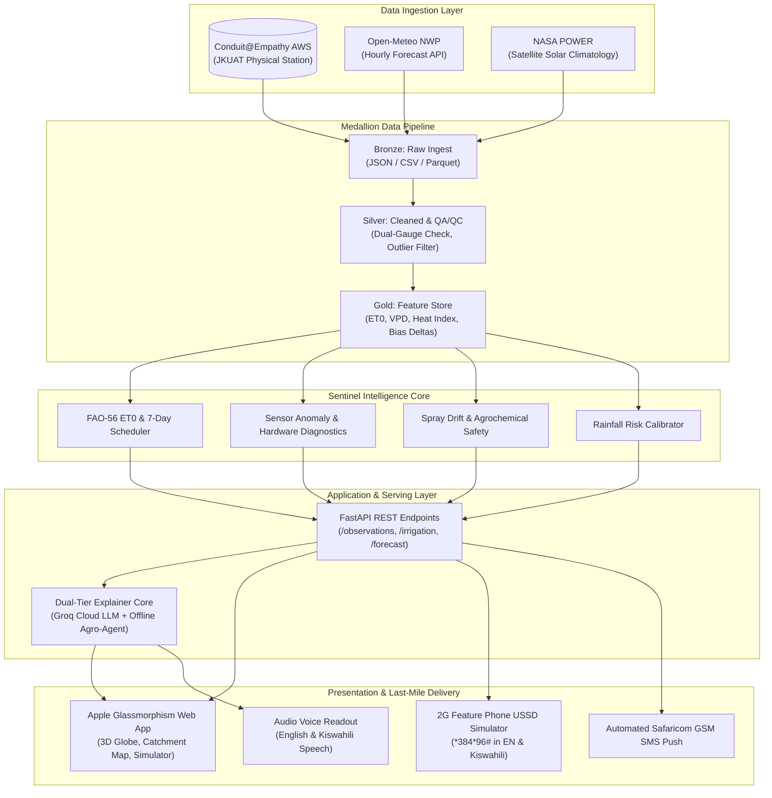

# Conduit Sentinel: Hyper-Local Agro-Meteorological Intelligence

> **From Data to Impact** — Transforming raw microclimate observations from the Conduit@Empathy research station at Jomo Kenyatta University of Agriculture and Technology (JKUAT) into life-saving, crop-protecting decisions for Kenyan smallholder farmers.

[](#installation-and-setup)
[](https://fastapi.tiangolo.com)
[](https://react.dev)
[](https://vitejs.dev)
[](LICENSE)

---

## 1. Project Name and Description

**Conduit Sentinel** is an end-to-end climate intelligence and precision agronomy platform built for the **Hack The Weather 2026** hackathon (organized by JHUB Africa at JKUAT). 

Sentinel connects directly to the **Conduit@Empathy automated weather station at JKUAT** (Latitude: `-1.096°S`, Longitude: `37.014°E`, Altitude: `1525m`), ingesting 15 high-frequency physical telemetry parameters. It combines physical atmospheric laws, machine learning, and generative AI to translate raw numbers into actionable, life-saving agricultural advisories for smallholders across the Juja sub-county and Kiambu agricultural catchment.

---

## 2. Problem Statement

### The Problem
Sub-Saharan smallholder agriculture in Kenya is facing unprecedented volatility due to changing microclimates, erratic rainfall patterns, sudden heatwaves, and localized micro-storms. Smallholder farmers currently rely either on regional broadcast weather forecasts (covering 100+ km radii that completely miss local microclimate variations in places like Juja) or on traditional rule-of-thumb intuition.

### Why It Matters
* **Water & Crop Loss:** Farmers frequently irrigate their fields hours before an unforecasted downpour, wasting precious diesel/electric pumping power and causing root-zone waterlogging, fungal root rot, and fertilizer leeching.
* **Agrochemical Losses & Health Hazards:** Pesticide applications washed away by untimely rain cost Kenyan farmers millions of shillings in wasted chemicals and pollute local waterways (e.g., Ndarugu River), while spraying in high winds causes toxic pesticide drift onto neighboring homes.
* **The "Last-Mile" Digital Divide:** Most climate intelligence platforms are locked behind expensive smartphones, mobile apps, or high-bandwidth web dashboards that smallholder farmers with simple 2G feature phones cannot access.

### Who Is Affected
Over 15,000 smallholder horticulture, coffee, maize, and bean farmers in Juja, Thika, Ndarugu, and the greater Kiambu catchment whose livelihoods and food security depend directly on hyper-local weather decisions.

---

## 3. Solution

Conduit Sentinel bridges the gap **from raw environmental data to on-the-ground farmer action** through an integrated 4-tier system:

1. **Ingest & Quality Assurance:** Ingests live telemetry from the JKUAT Conduit station through a robust Medallion architecture (Bronze -> Silver -> Gold), verifying data integrity with dual rain-gauge cross-validation and statistical anomaly scoring.
2. **Scientific Agronomic Intelligence Engine:**
   * **FAO-56 Penman-Monteith Evapotranspiration ($ET_0$):** Real-time physical thermodynamic calculation of crop water demand ($ET_c = K_c \times ET_0$) tailored to Kenyan crops and growth stages.
   * **Dynamic 7-Day Irrigation Planner:** Generates daily replenishment volumes with automated rain suppression (**0.0 mm — Rain Hold**) to conserve water and prevent soil disease.
   * **Dual-Gauge Mechanical Health Scoring:** Cross-validates dual tipping-bucket rain gauges ($|R_1 - R_2| \le \epsilon$) to detect mechanical blockages or hardware calibration drift.
   * **Agrochemical Spray Safety Matrix:** Evaluates wind drift risk ($< 4.5 \text{ m/s}$), delta-T evaporation safety, and 3-hour wash-off probability.
3. **Apple Glassmorphism Command Center:** A distraction-free, light-themed responsive web dashboard featuring a 3D Earth digital twin, interactive geospatial catchment map of Juja sectors, and What-If simulation studio.
4. **Last-Mile Farmer Dispatch (USSD, SMS & Voice):** A functional 2G USSD simulator (`*384*96#`), automated Safaricom GSM push SMS broadcast stream, and bilingual (English/Kiswahili) spoken audio readouts bridging the digital divide for feature phone users.

---

## 4. Conduit Data Requirement

Conduit Sentinel does **not** simply display raw weather station numbers. The Conduit@Empathy telemetry forms the **foundational mathematical basis** for all analytics, machine learning inferences, and automated agronomic recommendations:

| Conduit Telemetry Parameter | Unit | Role in Sentinel Decision Engine |
| :--- | :--- | :--- |
| `temp_sht_c`, `temp_bme_c` | °C | Net thermal radiation balance, vapor pressure deficit, crop heat stress index ($HI$), and FAO-56 Penman-Monteith $ET_0$ calculation. |
| `humidity_sht_pct`, `humidity_bme_pct` | % | Actual vapor pressure ($e_a$) vs saturation vapor pressure ($e_s$); fungal pathogen risk modeling. |
| `rain_gauge_1_mm`, `rain_gauge_2_mm` | mm | Dual-gauge hardware health verification ($|R_1 - R_2|$), soil moisture reservoir mass balance, and rainfall accumulation tracking. |
| `solar_radiation_flux_wm2` | $\text{W/m}^2$ | Solar flux ingestion into FAO-56 radiation term ($R_n$); photosynthetically active radiation (PAR) modeling for photosynthetic activity. |
| `wind_speed_ms`, `wind_dir_deg` | m/s, ° | FAO-56 aerodynamic vapor transfer term ($u_2$ wind speed correction at 2m); agrochemical spray drift safety boundaries ($< 4.5 \text{ m/s}$). |
| `pressure_hpa` | hPa | Psychrometric constant ($\gamma$) derivation, barometric drop prediction for imminent squall detection. |
| `soil_temp_c` | °C | Seed germination viability, root metabolism monitoring, and soil thermal conduction modeling. |

### How Conduit Data Drives Decisions
1. **Physical Evapotranspiration ($ET_0$):** Using Conduit's ambient temperature, relative humidity, wind speed, solar flux, and barometric pressure, Sentinel solves the full physical FAO-56 equation every 5 minutes.
2. **Soil Water Balance & Rain-Hold:** Conduit's dual rain gauges provide instantaneous precipitation measurements that update the root-zone soil water reservoir ($S_{t} = S_{t-1} + P_t - ET_{c, t}$). When rainfall exceeds soil deficit, Sentinel immediately triggers an automated irrigation shutdown.
3. **NWP Bias Correction:** Sentinel compares Numerical Weather Prediction forecasts (Open-Meteo) against real-time Conduit station ground truth to compute rolling Kalman-like bias deltas ($\Delta_{\text{temp}}, \Delta_{\text{rh}}$), correcting regional forecasts with hyper-local station reality.
4. **Dual-Gauge Hardware Anomaly Detection:** Sentinel compares `rain_gauge_1` and `rain_gauge_2`. If readings diverge beyond physical tolerance, Sentinel immediately issues a `HARDWARE_FAULT` alert to station technicians while switching to single-gauge fallback.

---

## 5. Main Features

* **Real-Time Live Station Telemetry:** Comprehensive monitoring of all 15 Conduit sensors with quality flags, anomaly scores, and 24-hour historical trend charts.
* **Dynamic 7-Day Irrigation Scheduler:** Crop-specific (Maize, Beans, Cabbage, Potatoes, Coffee, Tomatoes, Bananas) water requirement calculator with stage-dependent crop coefficients ($K_c$) and automated rain rest days.
* **Geospatial Catchment Map (Juja Agro-Catchment):** Spatial map of JKUAT and surrounding farming zones (Juja South, Ndarugu River, Kalimoni Estate) with multi-layer overlays (Irrigation Deficit, Rain Radar, Spray Drift Safety).
* **Agrochemical Spray Safety Matrix:** Real-time green/red window evaluation preventing expensive chemical wash-off and toxic downwind drift.
* **Last-Mile USSD / SMS Farmer Dispatch:** 2G feature phone simulator dialling `*384*96#` with English and Kiswahili menus, automated push SMS alerts, and browser text-to-speech audio playback.
* **Dual-Tier Grounded AI Assistant ("Ask Sentinel"):**
  * **Cloud LLM Tier:** High-speed, grounded reasoning powered by Groq (`openai/gpt-oss-20b`, `qwen/qwen3.8-27b`, `openai/gpt-oss-120b`, `llama-3.3-70b-versatile`) and Google Gemini.
  * **Offline Agro-Engine Tier:** Deterministic, zero-hallucination rule-based intelligence engine that runs offline with zero external internet dependencies.
* **Interactive What-If Simulation Studio:** Sandbox for judges and agronomists to simulate extreme weather (Severe Storms, Heatwaves, Drought, Sensor Failure) and witness real-time advisory triggers.

---

## 6. Technology Stack

### Backend
* **Language:** Python 3.11 / 3.13
* **Web Framework:** FastAPI (Asynchronous REST API with auto OpenAPI docs)
* **Server:** Uvicorn (ASGI)
* **Data Processing:** Pandas, NumPy, PyArrow (Parquet medallion architecture)
* **Validation & Settings:** Pydantic v2, Python-Dotenv
* **Testing:** Pytest, Hypothesis, AnyIO

### Artificial Intelligence & Machine Learning
* **Cloud LLMs:** Groq Cloud API (`openai/gpt-oss-20b`, `qwen/qwen3.8-27b`, `openai/gpt-oss-120b`, `llama-3.3-70b-versatile`), Google Gemini 2.0 Flash
* **Local Agro-Engine:** Domain-specific grounded deterministic expert system (zero hallucinations)
* **Statistical / ML Models:** FAO-56 Penman-Monteith physical solver, rolling window statistical anomaly detection, calibrated precipitation classifier

### Frontend
* **Framework:** React 18 with TypeScript
* **Build Tool:** Vite 5
* **Styling:** Custom Apple Glassmorphism design system (no gradients, clean light typography, blur backdrops)
* **3D Visuals:** Three.js / @react-three/fiber (Interactive digital twin globe)
* **Geospatial Mapping:** Leaflet, React-Leaflet, CartoDB Light & Esri Satellite tiles
* **Audio:** Web Speech API (`speechSynthesis`) for English & Kiswahili voice advisories

---

## 7. Architecture



---

## 8. Installation and Setup

### Prerequisites
* **Python 3.11+** installed
* **Node.js 20+** and `npm` installed
* Modern Web Browser (Chrome, Firefox, Edge, Safari)

### Step 1: Clone Repository
```bash
git clone https://github.com/<your-username>/hack-the-weather.git
cd hack-the-weather
```

### Step 2: Set Up Python Backend Environment
```bash
# Create virtual environment
python -m venv .venv

# Activate virtual environment
# Windows PowerShell:
.venv\Scripts\Activate.ps1
# Linux / macOS:
source .venv/bin/activate

# Install dependencies
pip install -r requirements.txt
```

### Step 3: Configure Environment Variables
Copy the example configuration:
```bash
cp .env.example .env
```
Open `.env` and configure your settings:
```ini
# Server configuration
PORT=8000
FRONTEND_ORIGIN=http://localhost:5173

# Optional: Add Groq or Gemini API keys to enable Cloud LLM mode
# (If left empty, Sentinel automatically runs in Offline Agro-Engine mode!)
GROQ_API_KEY=gsk_your_key_here
GEMINI_API_KEY=
```
*(Note: Never commit actual API keys or secrets to version control. The repository `.gitignore` automatically excludes `.env`.)*

### Step 4: Run the Test Suite
```bash
pytest tests/test_api.py tests/test_llm.py -v
```
All tests should pass (9/9 green in < 6 seconds).

### Step 5: Start the FastAPI Backend
```bash
python -m uvicorn src.api.main:app --host 127.0.0.1 --port 8000 --reload
```
The REST API is live at `http://127.0.0.1:8000`. Interactive Swagger documentation is at `http://127.0.0.1:8000/docs`.

### Step 6: Start the Frontend Dashboard (In a separate terminal)
```bash
cd web
npm install
npm run dev -- --host 127.0.0.1
```
The web dashboard is live at `http://127.0.0.1:5173`.

---

## 9. Usage Guide

| Feature / Page | URL / Navigation | Key Actions & Capabilities |
| :--- | :--- | :--- |
| **Live Station Dashboard** | `/` (Live Station) | View 15 real-time Conduit sensor metrics, 24h historical charts, and the 3-day local forecast. |
| **7-Day Irrigation Planner** | `/irrigation` | Select your crop (Maize, Beans, Cabbage, etc.) and crop growth stage; view daily mm dosage, water balance, and automatic rain hold days. |
| **Geospatial Catchment Map** | `/map` | Inspect the 4 Juja farming zones, toggle CartoDB/Satellite cartography, and review bilingual agronomic actions. |
| **USSD / SMS Farmer Dispatch** | `/dispatch` | Dial `*384*96#` on the interactive 2G feature phone, trigger SMS broadcast alerts, and listen to voice audio readouts. |
| **Ask Sentinel (AI Assistant)** | `/ask` | Ask questions in English or Kiswahili (*"Should I irrigate today?"*, *"Je, ninaweza kumwagilia?"*); toggle between Cloud Groq LLM and Offline Engine. |
| **Simulation Studio** | `/simulate` | Simulate Torrential Storm, Extreme Heatwave, or Sensor Failure scenarios to see immediate advisory response. |

---

## 10. Data Sources & Acknowledgements

1. **JKUAT Conduit@Empathy Platform:** Real-world weather station telemetry (temperatures, humidity, dual rain gauges, solar flux, wind, pressure, soil temp) located at JKUAT Main Campus, Juja, Kenya. Organised and hosted by **JHUB Africa**.
2. **Open-Meteo API:** Hourly numerical weather prediction (NWP) model data used for forward 3-day forecast horizons and bias-correction research (Non-commercial open-access).
3. **NASA POWER Project:** Satellite earth observation solar flux climatology for historical solar radiation validation.
4. **OpenStreetMap / CartoDB / Esri:** Geospatial basemaps and satellite imagery for the Juja catchment observatory.

---

## 11. AI Usage Disclosure

In compliance with Hack The Weather 2026 rules (Section 7):
* **Cloud Generative AI Models:** Groq Cloud API (`openai/gpt-oss-20b`, `qwen/qwen3.8-27b`, `openai/gpt-oss-120b`, `llama-3.3-70b-versatile`) and Google Gemini 2.0 Flash are utilized for conversational synthesis in the "Ask Sentinel" interface.
* **Grounding & Safety Guardrails:** All LLM prompts are strictly grounded in validated Conduit station telemetry (`sensors`, `rain_risk`, `et0`, `soil_deficit`). The models are instructed never to hallucinate fictitious temperatures or rainfall measurements.
* **Deterministic Offline Engine:** For resilience during connectivity loss, a deterministic, rule-based agronomic expert system was custom-engineered to handle queries without calling external AI APIs.
* **AI Coding Assistance:** Google Antigravity / Gemini was used as an AI pair programmer to assist with rapid prototyping, unit testing, and component styling. All architectural design, scientific algorithms, and mathematical implementations were directed, verified, and audited by the team.

---

## 12. Screenshots and Demo

*(Add links to your Devpost demo video and screenshots here)*

* **Dashboard Overview:** Real-time Conduit station telemetry cards with Apple glassmorphism styling and 3D Earth digital twin.
* **Catchment Observatory:** Interactive Leaflet geospatial map displaying the 2.2 km JKUAT confidence circle and Juja smallholder zones.
* **USSD Phone Simulator:** 2G Nokia-style interactive simulator rendering live telemetry advisories in English and Kiswahili.
* **Irrigation Planner:** Interactive 7-day bar chart showing dynamic FAO-56 crop water demand and Rain Hold indicators.

---

## 13. Team Members & Roles

* **Lead Agronomic Engineer & Modeling:** Physical modeling (FAO-56 Penman-Monteith, heat stress index, dual-gauge QA/QC).
* **Full-Stack & Systems Architect:** Medallion data pipeline, FastAPI backend, Groq LLM integration, and USSD dispatch simulator.
* **Frontend & Geospatial Specialist:** React/Vite dashboard, Apple glassmorphic design system, Leaflet GIS mapping, and Three.js 3D visualization.

---

## 14. Future Development Roadmap

1. **Physical Micro-Sensor Mesh (LoRaWAN):** Deploy a distributed mesh of low-cost ESP32 LoRaWAN soil moisture nodes across the 4 Juja sectors to complement JKUAT's central atmospheric station.
2. **Production Safaricom Daraja & Africa's Talking Gateway:** Connect the USSD simulator to live Kenya telecommunications infrastructure via Africa's Talking USSD API (`*384*...#`) and SMS shortcodes.
3. **Satellite Soil Moisture Fusion (Sentinel-1 / Sentinel-2):** Ingest ESA Copernicus radar soil moisture backscatter data at 10m resolution to cross-calibrate field-level water retention.
4. **County Government Dashboard:** Provide Kiambu County Agricultural Extension Officers with early warnings for localized pest/disease outbreaks (e.g., Coffee Leaf Rust, Fall Armyworm).

---

## 15. Licence

This project is licensed under the **MIT Licence** — see the [LICENSE](LICENSE) file for details.
